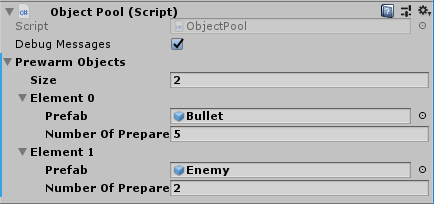
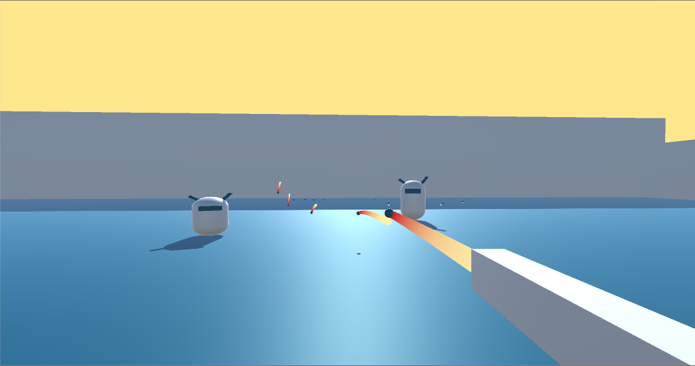

# Object tub
Object tub is a simple and easy to use object pooling system for Unity games.

## Usage setup:
- Import ObjectTub.unitypackage into your project.
- Make sure to include scripts and prefab in the import, the example folder is optional.
- Use the ObjectPool and PoolableObject classes as explained below:

## ObjectPool usage:
- Create a GameObject in the scene called ObjectPool, and attach the ObjectPool script to it (You can also use the prefab of the ObjectPool)
- In scripts that need to create instances of objects, use `ObjectPool.TakeObjectFromTub(prefabOfObjectToCreate)`
 - You will need to use the ObjectTub namespace to access the ObjectPool, so include `using ObjectTub;` at the top of scripts that use the object pool
- In scripts that destroy instances of objects, use `ObjectPool.PutObjectBackInTub(objectToPutBack)`. Again, put `using ObjectTub;` at the top of scripts that need to do this
- Pre-warm the object pool by specifying in the inspector of the ObjectPool script which objects and how many of each to instantiate when the scene loads

## PoolableObject usage:
- Objects that will be managed by the pool should extend the PoolableObject abstract class
- Implement the methods to specify what the object should do when it's taken out of the pool and put back in the pool:

 - InitializeForUse() is called when the object is obtained for reuse
        		Example things to do in the implementation of this method:
        			Initialize game stats like HP, stamina, etc
        			Allocate resources the object needs, such as files to read from
        			Reset the object's transform and rigidbody's velocity and angular velocity
 - PutAway() is called when the object will be deactivated and put back in the pool
        		Example things to do in the implementation of this method:
              			Stop sound effects the object is playing
              			Release allocated resources
              			Stop particle effects
						
## Making a build of the package:
- In Unity, do Assets -> Export Package and select all asset files
